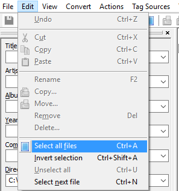

## Autoplaylist Creation

### Credits
--------------------

There is already a 3rd party program to make autoplaylist and it is works perfectly 
Credit has to go to @ridgerunner for mentioning it in his post on RCGroups.com

Here is the post ["Ridgerunr" discusses Mp3Tag for creating playlists](https://www.rcgroups.com/forums/showpost.php?p=31361271&postcount=41772)

It took a while to get the syntax exactly right for use in TarniTunes so here are the short directions to get you started.

### English Instructions
--------------------

1. Copy the .wav files you want to make into a playlist to a new folder.    
    The program works with directories.  It will load the entire directory if you try and load your files already in /sounds.     
If you haven't converted the files yet using [Audacity](http://www.audacityteam.org), now would be a good time.  They must be converted to mono, preferably normalized, and encoded in Microsoft WAV 16-bits signed PCM at a 32 kHz sampling rate.
2. Download the program [Mp3tag](http://www.mp3tag.de/en/)(consider making a donation)
3. Install the program
4. Run the program

### Using the Program
------------
1. Under `File` Choose "Add directory..."        

1.  Go to the directory (folder) you placed the files in.
2.  The screen will populate with your songs.
3.  Edit the 'Title' Metatag to what you would like to see as the 'songname' on your transmitter.
4.  Under `Edit` Choose "Select all files" or simply press Ctrl-A       
  
Sort your playlist using tracks this will allow you to edit the track number and get your music in the order you want to hear it.
5. Under `File` Choose "Export"        

6. A screen will appear click the star to make a new conversion.    

7. conversion make it something that you will remember  i.e.  `playlist` or `taranis`   

8. A window will open to `Edit` your new file.
  If prompted to select a file to edit the file, choose your favorite text editor `notepad`, `LuaEdit` etc.
  If the window does not automatically open click on the pencil/paper icon to edit the file.
  
9. Delete the sample information within the file.
10. Here is the syntax to type into the file (you can also copy/paste the syntax).

$filename(playlist.lua,utf-8)playlist={$loop(%track%)
{"%title%","%_filename%",%_length_seconds%},$loopend()
}    

It will ask if you want to preview your file. I would recommend checking the file to ensure all of the songs are there and that there are no extra lines beyond the "}" at the end of the file.    

Copy the playlist.lua file to the correct directory that will be referenced by `"TaraniTunes"` 
and enjoy your new playlist.
