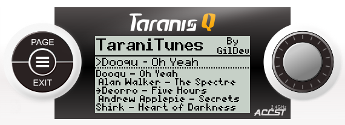
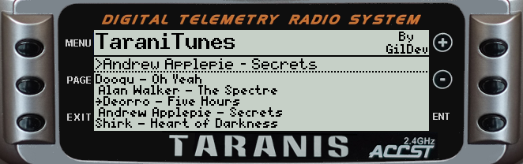
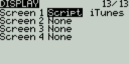
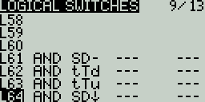
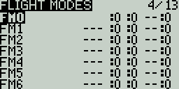

TaraniTunes
===========

*Awesome music player for FrSky Taranis radios.*

Compatible with FrSky's [Taranis Q X7](https://www.frsky-rc.com/product/taranis-q-x7-2), [Taranis X9D](https://www.frsky-rc.com/product/taranis-x9d-plus-2) and their variants.
You need at least [OpenTX](http://www.open-tx.org) 2.2.

* Taranis Q X7  
  
* Taranis X9D  
  

English instructions
--------------------

Here's a video explaining everything, from the installation to the usage:

### Installation

The “[Example](Example)” folder contains an exemple of the Taranis' SD card structure you must follow. It works, you can, if you want, merge it with your Taranis' current SD card content. You currently need to have at least 5 songs for the script to work.

1. On your computer:
	1. Edit [`iTunes.lua`](iTunes.lua) according to your preferences if needed then put `iTunes.lua` in `/SCRIPT/TELEMETRY`.
	2. Create a [`playlist.txt`](Example/SOUNDS/playlist.txt) file in `/SOUNDS` where each line must be formatted like this: `Song name:SONG_FILENAME` where `SONG_FILENAME` must be 6 characters or less. Don't end the file with a newline! Look at “[Example/SOUNDS/playlist.txt](Example/SOUNDS/playlist.txt)” for an example of formatting.
	3. Put your corresponding songs `SONG_FILENAME.wav` in `/SOUNDS/en` if your radio is in English (otherwise replace `en` with your language, the folder where you put your other sound files). They must be encoded in Microsoft WAV 16-bits signed PCM at a 32 kHz sampling rate, you can use [Audacity](http://www.audacityteam.org) to do that, it works great.

2. On your Taranis (I'm going to explain how I setup my radio):
	1. Set “DISPLAY” model's setting screen as follow:  
	
	2. Set “LOGICAL SWITCHES” model's setting screen as follow:  
	
	3. Set “FLIGHT MODES” model's setting screen as follow:  
	  
	In fact, put every throttle trims to “`--`” for every flight mode you use.

There you go! Next section will explain you how to use TaraniTunes.

### Usage

From the main screen, hold “Page” to access TaraniTunes. If everything has been setup correctly, your songs should appear, otherwise:

* If you modified your [`iTunes.lua`](iTunes.lua), maybe some configuration values are wrong.
* The `playlist.txt` syntax may be wrong. Be sure to put the song name, then the colon “:”, then the song filename of 6 characters maximum. Also make sure there is no empty line at the end, or you will get a “CPU Limit” error, yeah I probably need to fix that…

1. Use the rotary encoder (Q X7) or the “+”/“-” buttons to sweep through songs.
2. Press “Enter” to choose a song to play.
3. Put the “SD” switch in the middle position to start playing. Put it back in the up position to stop.
4. If you select another song, you have to stop and start playback (“SD” up then center again). I'm sorry I can't do it any other way…
5. Put “SD” in the down position to select a random song from your playlist then start playback again (“SD” in the center position).
6. You can press throttle trims down and up to play next and previous song respectively. You still have to stop and start playback to play it.

French instructions
-------------------

Voici une vidéo en Anglais qui explique tout, de l'installation à l'utilisation :

### Installation

Le dossier « [Example](Example) » contient un exemple de la structure de la carte SD que vous devez suivre. Ça marche, et vous pouvez, si vous le souhaitez, fusionner ce dossier avec le contenu actuel de la carte SD de votre Taranis. Vous devez pour l'instant avoir au moins 5 morceaux pour que le script marche.

1. Sur votre ordinateur :

1. Éditer [`iTunes.lua`](iTunes.lua) selon vos préférences, si nécessaire, et mettre ensuite `iTunes.lua` dans le dossier `/SCRIPT/TELEMETRY` ».
2. Créer un fichier [`playlist.txt`](Example/SOUNDS/playlist.txt) dans `/SOUNDS` dans lequel chaque ligne doit suivre le format suivant : `Nom de la chanson:NOM_DU_FICHIER` où `NOM_DU_FICHIER` doit être 6 caractères maximum. Ne pas terminer le fichier avec un saut de ligne ! Regardez « [Example/SOUNDS/playlist.txt](Example/SOUNDS/playlist.txt) » pour un exemple de fichier correctement formaté.
3. Mettre les morceaux correspondants `NOM_DU_FICHIER.wav` dans `/SOUNDS/fr` si votre radio est en français (sinon remplacez `fr` par votre langue, le dossier dans lequel vous placez vos autres sons). Ceux-ce doivent être encodés au format WAV Microsoft 16-bits non signé PCM à une fréquence d'échantillonnage de 32 kHz, comme les autres sons que vous utilisez. Vous pouvez utiliser [Audacity](http://www.audacityteam.org) pour faire ça, ça marche bien.

2. Sur votre Taranis (je vais expliquer comment je règle ma radio, avec le fichier « iTunes.lua » non modifié) :

1. Configurer l'écran de configuration du modèle « AFFICHAGE » comme ceci :  

2. Configurer l'écran de configuration du modèle « INTERS LOGIQUES » comme ceci :  

3. Configurer l'écran de configuration du modèle « PHASES DE VOL » comme ceci :  
  
Vous devez en fait régler chaque trim de gaz à « `--` » pour toutes les phases de vol que vous utilisez.

Et voilà ! La section suivante va expliquer comment se servir de TaraniTunes.

### Utilisation

Depuis l'écran principal, maintenez « Page » pour accéder à TaraniTunes. Si tout a été correctement configuré, vos morceaux devraient apparaître, sinon :

* Si vous avez modifié votre [`iTunes.lua`](iTunes.lua), des valeurs de configurations sont peut-être erronées.
* La syntaxe du fichier `playlist.txt` est peut-être incorrecte. Assurez-vous d'avoir écrit le nom du morceau, suivi de deux-points « : », suivi du nom du fichier de 6 caractères maximum. Faites également attention de ne pas avoir de saut de ligne à la fin du fichier sous peine d'avoir une erreur « CPU Limit ».

1. Utilisez l'encodeur (Q X7) ou les boutons « + »/« - » pour naviguer dans vos morceaux.
2. Appuyez sur « Enter » pour sélectionner un morceau à jouer.
3. Mettez l'interrupteur « SD » en position centrale pour démarrer la lecture. Mettez-le en position haute pour arrêter.
4. Si vous choisissez un autre morceau, vous devez arrêter et redémarrer la lecture (« SD » en haut puis à nouveau au centre). Je suis désolé on ne peut pas faire autrement…
5. Mettez « SD » en position basse pour sélectionner un morceau aléatoire puis relancez la lecture (« SD » en position centrale).
6. Vous pouvez utiliser le trim des gaz bas ou haut pour passer à la chanson suivante ou précédente respectivement. Vous devrez toujours relancer la lecture pour jouer la nouvelle musique.

Todo
----

* Automatically play next music after one is finished (maybe skip to next song when already 30 seconds have been played?)

Suggestions for OpenTX's API
----------------------------

* Constants to determine the radio type, useful when calculating switche's index because in special functions, logical switch 1 have the index 51 on Taranis X9D and 39 on Taranis Q X7.
* A function called when entering a telemetry screen. Useful to draw the screen *only* when needed and not every frame. Without that variable, when entering the telemetry screen more than once, the screen stays stuck onto the main screen.
* `table.insert(table, value)` doesn't seem to work, need to use `table[#table + 1] = value` instead.