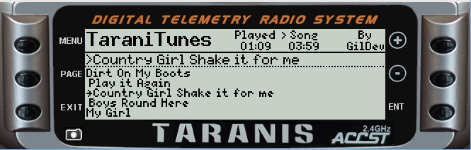
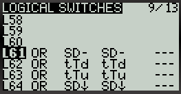
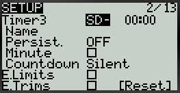

TaraniTunes v.2.1 have to finish the write up for the new version
auto playlist creator
multiple playlists
===========

*Awesome music player for FrSky Taranis radios.*

Compatible with FrSky's [Taranis Q X7](https://www.frsky-rc.com/product/taranis-q-x7-2), [Taranis X9D](https://www.frsky-rc.com/product/taranis-x9d-plus-2) and their variants.
You need at least [OpenTX](http://www.open-tx.org) 2.2.

* Taranis Q X7  
  
* Taranis X9D  
  

English instructions
--------------------

Here's a video explaining everything, from the installation to the usage.    
It has not been updated for this version but still helpful!

The installation process changed a bit, principaly the `playlist` syntax, the `Logical Switches` and `Timer3`.    
These changes automatically play the next song without user input allowing you too:     
"KEEP YOUR HANDS ON THE STICKS WHERE THEY BELONG!" while listening to music.    
Please refer to the following instructions.

### Installation

The “[Example](Example)” folder contains an example of the Taranis' SD card structure you must follow. It works, you can, if you want, merge it with your Taranis' current SD card content. You currently need to have at least 5 songs for the script to work.

1. On your computer:
	1. Edit [`iTunes.lua`](iTunes.lua) according to your preferences (if needed) then put `iTunes.lua` in `/SCRIPT/TELEMETRY`.
	2. Create a [`playlist.lua`](Example/SOUNDS/playlist.lua) file in `/SOUNDS` where each line must be formatted like this: `{"Song name", "SONG_FILENAME",Length},` `Song name` has a reasonble amount of room to identify the song name. `SONG_FILENAME` must be 6 characters or less. `Length` is a numeric number of seconds your song is: EXAMPLE - Your song is 3:45 long you would enter 225.  For a 4:52 song enter 292.  Simply multiply the minutes by 60 and add the remainging seconds to determine the seconds of your song. Song length can usually be found in the file properties. Look at “[Example/SOUNDS/playlist.lua](Example/SOUNDS/playlist.lua)” for an example of formatting.  
	3. Put your corresponding songs `SONG_FILENAME.wav` in `/SOUNDS/en` if your radio is in English (otherwise replace `en` with your language, the same folder where you put your other sound files). They must be converted to mono, preferably normalized, and encoded in Microsoft WAV 16-bits signed PCM at a 32 kHz sampling rate, you can use [Audacity](http://www.audacityteam.org) to do that, it works great. Remember the filename must be 6 characters or less or it will not play. 
	4. Activate "Timer3" using the trigger you set to `Play` the song.  Set it to count up and silence any minute calls for this timer. You may have to come back to this step after you finalize the settings in your radio to ensure the correct trigger is assigned.

2. On your Taranis (I'm going to explain how I setup my radio):
	1. Set “DISPLAY” model's setting screen as follow:  
	
	2. Set “LOGICAL SWITCHES” model's setting screen as follows:  
	 
	3. Set “FLIGHT MODES” model's setting screen as follows:     
	  
	In fact, put every throttle trims to “`--`” for every flight mode you use.
	4. Set "TIMER3" settings as follows:      
	   

There you go! Next section will explain you how to use TaraniTunes.

### Usage

From the main screen, hold “Page” to access TaraniTunes. If everything has been setup correctly, your songs should appear, otherwise:

* If you modified your [`iTunes.lua`](iTunes.lua), maybe some configuration values are wrong.
* The `playlist.lua` syntax may be wrong. Please check that.

1. Use the rotary encoder (Q X7) or the “+”/“-” buttons to sweep through songs.
2. Press “Enter” to choose a song to play.
3. Put the “SD” switch in the middle position to start playing. Put it back in the up position to stop/pause the song.
4. Put “SD” in the down position to select a random song from your playlist.
5. You can press throttle trims down and up to play next and previous song respectively.
6. The next song will automatically play and Timer3 will reset to 0 
7. The Timer will also reset if you change songs.

French instructions
-------------------

Voici une vidéo en Anglais qui explique tout, de l'installation à l'utilisation :    
Il n'a pas été mis à jour pour cette version mais toujours utile!

Le processus d'installation a légèrement changé, notamment la syntaxe du fichier `playlist`, les `Logical Switches` et `Timer3`.    
Ces changements jouent automatiquement la chanson suivante sans intervention de l'utilisateur vous permettant aussi:    
"GARDEZ VOS MAINS SUR LES BÂTONS O WH ILS APPARTIENNENT!" en écoutant de la musique.    
Veuillez vous référer aux instructions suivantes.

### Installation

Le dossier « [Example](Example) » contient un exemple de la structure de la carte SD que vous devez suivre. Ça marche, et vous pouvez, si vous le souhaitez, fusionner ce dossier avec le contenu actuel de la carte SD de votre Taranis. Vous devez pour l'instant avoir au moins 5 morceaux pour que le script marche.

1. Sur votre ordinateur :

	1. Éditer [`iTunes.lua`](iTunes.lua) selon vos préférences (si nécessaire) et mettre ensuite `iTunes.lua` dans le dossier `/SCRIPT/TELEMETRY` ».
	2. Créer un fichier [`playlist.lua`](Example/SOUNDS/playlist.lua) fichier dans `/ SOUNDS` où chaque ligne doit être formatée comme ceci: `{"Nom de la chanson", "SONG_FILENAME", Longueur}`, `Nom de la chanson` a une quantité raisonnable d'espace pour identifier le nom de la chanson. `SONG_FILENAME` doit avoir 6 caractères ou moins. `Longueur` est un nombre numérique de secondes votre chanson est: EXEMPLE - Votre chanson est 3:45 longtemps vous entreriez 225. Pour une chanson 4:52 entrez 292. Il suffit de multiplier les minutes par 60 et ajouter les secondes restantes pour déterminer La durée de la chanson peut généralement être trouvée dans les propriétés du fichier Regardez “[Example/SOUNDS/playlist.lua](Example/SOUNDS/playlist.lua)” pour un exemple de formatage.   
	3. Mettre les morceaux correspondants `NOM_DU_FICHIER.wav` dans `/SOUNDS/fr` si votre radio est en français (sinon remplacer `fr` avec votre langue, le même dossier où vous mettez vos autres fichiers son). Ceux-ci doivent être converti en mono, préférablement normalisés, et encodés au format WAV Microsoft 16-bits non signé PCM à une fréquence d'échantillonnage de 32 kHz, comme les autres sons que vous utilisez. Vous pouvez utiliser [Audacity](http://www.audacityteam.org) pour faire ça, ça marche bien.  Rappelez-vous que le nom de fichier doit contenir 6 caractères ou moins, sinon il ne sera pas lu.   
	4. Activez "Timer3" en utilisant le déclencheur que vous avez réglé pour `Jouer` la chanson. Réglez-le pour compter et faire taire tous les appels minute pour cette minuterie. Vous devrez peut-être revenir à cette étape après avoir finalisé les paramètres de votre radio pour vous assurer que le déclencheur correct est attribué.

2. Sur votre Taranis (je vais expliquer comment je règle ma radio, avec le fichier « iTunes.lua » non modifié) :

	1. Configurer l'écran de configuration du modèle « AFFICHAGE » comme ceci :   
	
	2. Configurer l'écran de configuration du modèle « INTERS LOGIQUES » comme ceci :   
	    
	3. Configurer l'écran de configuration du modèle « PHASES DE VOL » comme ceci :   
	   
	Vous devez en fait régler chaque trim de gaz à « `--` » pour toutes les phases de vol que vous utilisez.    
	
	4. Configurer l'écran de configuration du modèle "Timer3" comme ceci :  
	   

Et voilà ! La section suivante va expliquer comment se servir de TaraniTunes.

### Utilisation

Depuis l'écran principal, maintenez « Page » pour accéder à TaraniTunes. Si tout a été correctement configuré, vos morceaux devraient apparaître, sinon :

* Si vous avez modifié votre [`iTunes.lua`](iTunes.lua), des valeurs de configurations sont peut-être erronées.
* La syntaxe du fichier `playlist.lua` est peut-être incorrecte. Vérifiez-la.

1. Utilisez l'encodeur rotatif (Q X7) ou les boutons "+" / "-" pour parcourir les morceaux.
2. Appuyez sur "Entrée" pour choisir une chanson à jouer.
3. Mettez l'interrupteur "SD" en position centrale pour commencer à jouer. Remettez-le en position haute pour arrêter / mettre en pause la chanson.
4. Mettez "SD" en position basse pour sélectionner une chanson aléatoire de votre liste de lecture.
5. Vous pouvez appuyer sur les commandes d'accélération vers le bas et vers le haut pour lire les pistes suivante et précédente respectivement.
6. La chanson suivante jouera automatiquement et Timer3 sera remis à 0
7. La minuterie se réinitialisera également si vous changez de chanson.   

Todo
----
Automate playlist.lua creation - No idea how to do this (at the moment)

Suggestions for OpenTX's API
----------------------------

* Constants to determine the radio type, useful when calculating switch's index because in special functions, logical switch 1 have the index 51 on Taranis X9D and 39 on Taranis Q X7.
* A function called when entering a telemetry screen. Useful to draw the screen *only* when needed and not every frame. Without that variable, when entering the telemetry screen more than once, the screen stays stuck onto the main screen.
* `table.insert(table, value)` doesn't seem to work, need to use `table[#table + 1] = value` instead.
