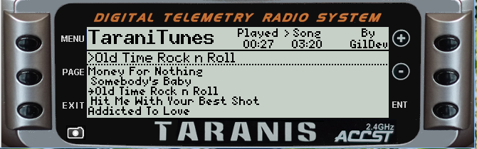
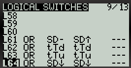

TaraniTunes v2.1 
===========
*Awesome music player for FrSky Taranis radios.*

**Now featuring 4 selectable playlists to enjoy!**

Compatible with FrSky’s [Taranis Q X7](https://www.frsky-rc.com/product/taranis-q-x7-2), [Taranis X9D](https://www.frsky-rc.com/product/taranis-x9d-plus-2) and their variants.
You need at least [OpenTX](http://www.open-tx.org) 2.2.

* Taranis Q X7  
  
* Taranis X9D  
  

English Instructions
--------------------

Here’s a video explaining everything, from the installation to the usage.    
It has not been updated for this version but still helpful!

The installation process changed a bit, principally the `playlist.lua` file’s syntax, the “Logical Switches” and “Timer3” configuration.  
These changes allows TaraniTunes to automatically play the next song without taking your hands off the sticks.  
Please refer to the following instructions.

### Installation

The “[Example](Example)” folder contains an example of the Taranis’ SD card structure you must follow. It works, and you can, if you want to, merge it with your Taranis’ current SD card content in order to try the script.  
You currently need to have at least 5 songs for the script to work.  
All of the music are located in `/SOUNDS` on the SD card, but there is a special directory structure for the playlists.

1. On your computer:
	1. Edit [`main.lua`](main.lua). Detailed instructions are in the file’s comments to select the switches used for “Pause” and “Random” actions. Place both `main.lua` and `iTunes.lua` in `/SCRIPT/TELEMETRY` on your SD card.

	2. Create the following folders on your SD card: `/SOUNDS/lists/1`, `/SOUNDS/lists/2`, `/SOUNDS/lists/3` and `/SOUNDS/lists/4`.

2. Create a [`playlist.lua`](Example/SOUNDS/lists/1/playlist.lua) file in each of those directories.
	1. I recommend using [`Mp3tag`](https://www.mp3tag.de/en/index.html) to create your playlists. It will automatically add the required informations in TaraniTunes’ format. *Please look at the instructions in [`Auto_Playlist`](/Auto_Playlist)*.

	2.  If you prefer to manually create the playlist files. Each line must be formatted like this:   
	`{"Song name", "SONG_FILENAME", duration},` 
		1. `Song name` is the full name, with artist if you want.
		2. `SONG_FILENAME` must be 6 characters or less. 
		3. `duration` is your song’s duration in seconds. *EXAMPLE - Your song is 3:45 long you would enter 225. For a 4:52 song enter 292. Simply calculate `minutes × 60 + seconds` to get your song’s duration. Song length can usually be found in the file’s properties.*  
		Look at “[Example/SOUNDS/lists/1/playlist.lua](Example/SOUNDS/lists/1/playlist.lua)” for an example of formatting.

	3. Put your corresponding songs `SONG_FILENAME.wav` in `/SOUNDS/en` if your radio is in English (otherwise replace `en` with your language). They must be converted to mono, preferably normalized, and encoded in Microsoft WAV 16-bits signed PCM at a 32 kHz sampling rate, you can use [Audacity](http://www.audacityteam.org) to do that, it works great. Remember the filename must be 6 characters or less or else it will not play.

	4. Set “Timer3” to activate with your `Play` switch. Set it to count up and mute minutes reminders. You may have to come back to this step after you finish setting up your radio to ensure the correct switch is assigned.

3. On your Taranis (I’m going to explain how I setup my radio):
	1. Set “DISPLAY” model’s setting screen as follows:  
	
	2. Set “LOGICAL SWITCHES” model’s setting screen as follows:  
	 
	3. Set “FLIGHT MODES” model’s setting screen as follows:     
	  
	In fact, put every throttle trims to “`--`” for every flight mode you use.
	4. Set “TIMER3” settings as follows:      
	   

There you go! Next section will explain how to use TaraniTunes.

### Usage

From the main screen, hold “Page” to access TaraniTunes. If everything has been setup correctly, your songs should appear, otherwise:

* If you modified additional code in [`main.lua`](main.lua), beyond setting the switch values, maybe some configuration values are wrong.
* The `playlist.lua` syntax may be wrong. Please check that.

1. Use the rotary encoder (Q X7) or the “+”/“-” (Taranis) buttons to sweep through songs.
2. Press “Enter” to choose a song to play.
3. Put the “SD” switch in the middle position to start playing. Put it back in the up position to stop/pause the song.
4. Put “SD” in the down position to select a random song from your playlist.
5. You can press throttle trims down and up to play next and previous song respectively.
6. When the song ends, the next song will automatically play and “Timer3” will be reset.
7. “Timer3” will also automatically resets if you change songs.

#### Changing Playlists

* The playlist contained in `/list/1` will always load first when TaraniTunes is started.
1. To change playlists press “MENU”.
2. A “Change Playlist Screen” will appear:  
     
3. Using **Rotary Switch S2**, select the playlist you want to play (1 to 4).
4. Press “ENTER”, your new playlist is loaded and begins playing.

Instructions en Français
------------------------

Voici une vidéo en Anglais qui explique tout, de l’installation à l’utilisation :  
La vidéo n’est plus à jour pour cette version de TaraniTunes mais peut toujours être utile.

Le processus d’installation a un peu changé, principalement la syntaxe des fichiers `playlist.lua`, les « Interrupteurs Logiques » et la configuration de « Timer3 ».  
Ces changements permettent à TaraniTunes de jouer automatiquement le prochain morceau sans que vous ayez besoin de lâcher les manches.  
Veuillez vous référer aux instructions suivantes.

### Installation

Le dossier « [Example](Example) » contient un exemple de la structure de la carte SD de Taranis que vous devez suivre. Ça marche, et vous pouvez, si vous le souhaitez, fusionner ce dossier avec le contenu actuel de la carte SD de votre Taranis pour essayer.  
Vous devez actuellement avoir au moins 5 chansons pour que le script fonctionne.  
Toute la musique est située dans `/SOUNDS`, mais il y une structure de dossiers particulière pour les playlists.

1. Sur votre ordinateur :

	1. Modifiez [`main.lua`](main.lua). Les instructions détaillées sont dans les commentaires du fichier configurer les interrupteurs à utiliser pour les actions “Pause” et “Random” (aléatoire). Placez `main.lua` et` iTunes.lua` dans `/SCRIPT/TELEMETRY` sur votre carte SD.
	2. Créez les dossiers suivants sur votre carte SD : `/SOUNDS/lists/1`, `/SOUNDS/lists/2`, `/SOUNDS/lists/3` and `/SOUNDS/lists/4`.
	
	2. Créez un fichier [`playlist.lua`](Example/SOUNDS/lists/1/playlist.lua) dans chacun de ces dossiers.
		1. Je recommande d’utiliser [`Mp3tag`](https://www.mp3tag.de/en/index.html) pour créer vos playlists. Il ajoutera automatiquement les informations requises au format TaraniTunes. Regardez les instructions dans [`Auto_playlist`](/ Auto_Playlist) pour plus d’informations.
		2. Si vous préférez créer manuellement les fichiers de playlist, chaque ligne doit être formatée comme ceci : `{"Nom du morceau","NOM_DU_FICHIER", duree},`
			1. `Nom du morceau` est le nom complet, avec le nom de l’artiste si vous le souhaitez.
			2. Le `NOM_DU_FICHIER` doit comporter 6 caractères ou moins.
			3. `duree` est la durée du morceau en secondes.  
			EXEMPLE - Votre chanson dure 3:45, vous entrez 225. Pour une chanson qui dure 4:52, entrez 292.  
			Calculez simplement `minutes × 60 + secondes` pour obtenir la durée de votre morceau. La durée du morceau peut parfois être trouvée dans les propriétés du fichier.
			Regardez « [Example/SOUNDS/lists/1/playlist.lua](Example/SOUNDS/lists/1/playlist.lua) » pour un exemple de formatage.
	 
	3. Mettre les morceaux correspondants `NOM_DU_FICHIER.wav` dans `/SOUNDS/fr` si votre radio est en français (sinon remplacez `fr` par votre langue, le dossier dans lequel vous placez vos autres sons). Ceux-ci doivent être converti en mono, préférablement normalisés, et encodés au format WAV Microsoft 16-bits non signé PCM à une fréquence d’échantillonnage de 32 kHz, comme les autres sons que vous utilisez. Vous pouvez utiliser [Audacity](http://www.audacityteam.org) pour faire ça, ça marche bien. N’oubliez pas que le nom du fichier doit faire 6 caractères ou moins.   

	4. Réglez le « Timer3 » pour qu’il s’active avec votre interrupteur `Play`. Réglez-le pour compter et supprimez les rappels toutes les minutes. Vous devrez peut-être revenir à cette étape une fois votre radio réglée pour vérifier que l’interrupteur est bien réglé.

2. Sur votre Taranis (je vais expliquer comment je règle ma radio, avec le fichier « iTunes.lua » non modifié) :

	1. Configurer l’écran de configuration du modèle « AFFICHAGE » comme ceci :  
	
	2. Configurer l’écran de configuration du modèle « INTERS LOGIQUES » comme ceci :  
	
	3. Configurer l’écran de configuration du modèle « PHASES DE VOL » comme ceci :  
	  
	Vous devez en fait régler chaque trim de gaz à « `--` » pour toutes les phases de vol que vous utilisez.
	4. Configurer le « Timer3 » comme ceci :  
	

Et voilà ! La section suivante va expliquer comment se servir de TaraniTunes.

### Utilisation

Depuis l’écran principal, maintenez « Page » pour accéder à TaraniTunes. Si tout a été correctement configuré, vos morceaux devraient apparaître, sinon :

* Si vous avez modifié du code supplémentaire dans [`main.lua`](main.lua), au-delà de la configuration des interrupteurs, certaines valeurs de configuration sont peut-être erronées.
* La syntaxe du fichier `playlist.lua` est peut-être incorrecte. Vérifiez-la.

1. Utilisez l’encodeur rotatif (Q X7) ou les boutons « + » / « - » pour parcourir les morceaux.
2. Appuyez sur “Enter” pour choisir une chanson à jouer.
3. Mettez l’interrupteur “SD” en position centrale pour commencer à jouer. Remettez-le en position haute pour arrêter/mettre en pause la chanson.
4. Mettez “SD” en position basse pour sélectionner une chanson aléatoire de votre playlist.
5. Vous pouvez utiliser le trim des gaz bas ou haut pour passer respectivement au morceau suivant ou précédent.
6. Quand le morceau se termine, le prochain morceau est automatiquent joué et « Timer3 » est réinitialisé.
7. « Timer3 » est également réinitialisé lorsque vous changez de morceau.

#### Changer de playlists

* La playlist contenue dans `/list/1` est toujours chargée en première lorsque TaraniTunes est lancé.
1. Pour changer de playlist, appuyez sur « Menu ».
2. L’écran `Change Playlist Screen` apparaîtra.  
     
3. En utilisant le **Commutateur Rotatif S2**, sélectionnez la playlist que vous souhaitez jouer (de 1 à 4).
4. Appuyez sur « Enter », votre nouvelle playlist est chargée et commence à jouer.

Todo
----
Awaiting user feedback for improvments

Suggestions for OpenTX’s API
----------------------------

* Constants to determine the radio type, useful when calculating switch’s index because in special functions, logical switch 1 have the index 51 on Taranis X9D and 39 on Taranis Q X7.
* A function called when entering a telemetry screen. Useful to draw the screen *only* when needed and not every frame. Without that variable, when entering the telemetry screen more than once, the screen stays stuck onto the main screen.
* `table.insert(table, value)` doesn’t seem to work, need to use `table[#table + 1] = value` instead.
